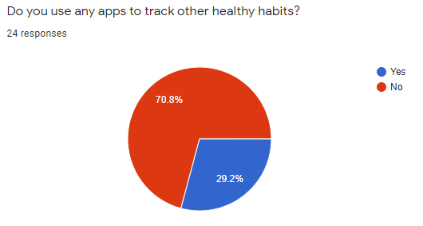
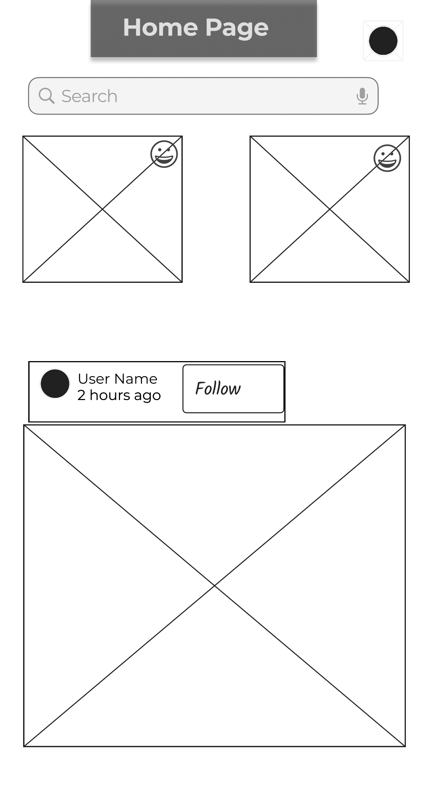

<div class="container">
<div class="tab-content">
    <div id="home" class="tab-pane fade in active">
      <h3>HOME</h3>
      <p>Lorem ipsum dolor sit amet, consectetur adipisicing elit, sed do eiusmod tempor incididunt ut labore et dolore magna aliqua.</p>
    </div>
    <div id="menu1" class="tab-pane fade">
      <h3>Understanding the problem</h3>
      <p>
      Over the past decade, our phones and smart devices have quickly become an extension of ourselves. We use it to capture memories by taking photos, to communicate with our family who may live thousands of miles away, to order food when we’re hungry and to hail a ride when we need to get somewhere. Not only do we use our devices for convenience's sake, but we now use them to get most of our work done and to entertain ourselves once we've stopped working. Unfortunately, this extensive use can take a toll on our body and mind as research has demonstrated.
      </p>
      </br>
      <p>
      For example the university of Gothenburg did a <a href="(https://www.recordgazette.net/screen-time-tied-to-health-issues/article_2d5aef9e-ddef-11e8-a22a-ebdc8aced172.html)"> study</a href="(https://www.ncbi.nlm.nih.gov/pmc/articles/PMC5769928/)"> where they found a link between heavy screen use and sleep disturbances and/or disorders. There have also been studies <a>linking screen media exposure to increased risks of obesity in children</a>
      </p>
    </div>
    <div id="menu2" class="tab-pane fade">
      <h3>Research</h3>
      <p>Sed ut perspiciatis unde omnis iste natus error sit voluptatem accusantium doloremque laudantium, totam rem aperiam.</p>
    </div>
    <div id="menu3" class="tab-pane fade">
      <h3>Data Analysis</h3>
      <p>Eaque ipsa quae ab illo inventore veritatis et quasi architecto beatae vitae dicta sunt explicabo.</p>
    </div>
    <div id="menu4" class="tab-pane fade">
      <h3>User Personas</h3>
      <p>Eaque ipsa quae ab illo inventore veritatis et quasi architecto beatae vitae dicta sunt explicabo.</p>
    </div>
  </div>
</div>

<h2 id= "understanding"> Understanding the problem</h2>

Over the past decade, our phones and smart devices have quickly become an extension of ourselves. We use it to capture memories by taking photos, to communicate with our family who may live thousands of miles away, to order food when we’re hungry and to hail a ride when we need to get somewhere. Not only do we use our devices for convenience's sake, but we now use them to get most of our work done and to entertain ourselves once we've stopped working. Unfortunately, this extensive use can take a toll on our body and mind as research has demonstrated.

For example the university of Gothenburg did a [study](https://www.recordgazette.net/screen-time-tied-to-health-issues/article_2d5aef9e-ddef-11e8-a22a-ebdc8aced172.html) where they found a link between heavy screen use and sleep disturbances and/or disorders. There have also been studies [linking screen media exposure to increased risks of obesity in children](https://www.ncbi.nlm.nih.gov/pmc/articles/PMC5769928/)

Healthy screen habits have become a hot topic recently with many companies trying to promote them. Apple has implemented its own screen time services where you can see data related to your screen use and set restrictions to help you control the amount of time you spend on your devices. There are also seperate apps like Forest which help you control the amount of time you spend procrastinating on your device.

As we won't stop using our devices anytime soon, there probably is or will be a demand for a super app which encourages and reinforces healthy habits that allows us to accomplish most of our daily tasks.

<h2 id= "research"> Research</h2>

### Impact of screen time on health

Several papers show that spending a lot of time in front of a computer combined with low physical activity is detrimental to one’s health and wellbeing.
Other papers show that sedentary behaviour itself (which is normally associated with screen time as the majority of people look at screens while sitting) is bad for your health independent of physical activity.

### Improving poor habits

The same research demonstrates the importance of clear, consistent and logical rules when it comes to screen time restrictions. It is simply infuriating for most people to lose functionality or access without knowing precisely why and what they should do about it when their screen time is restricted directly or indirectly.
Moreover, educational level, age and self-efficacy must be considered to devise appropriate solutions to reduce domestic screen time.

### Existing Super Apps

Looking at successful super apps, which were mostly developed and deployed in the East, we've found a few traits that make superapps attractive to its userbase.

**All features that a super app offers are consolidated**, the user does not need to download other apps, plugins, or extensions, the most commonly used features come pre-installed. All those features are made to be convenient and presented in an aesthetically similar format to guarantee the uniformity of the experience.

**Super app dashboards are as simple as possible** so it can achieve adoption as soon as possible. There should be minimal clutter, let the user navigate though submenus instead and then allow them to create shortcuts once they get used to using the app. There shouldn’t be clutter for accessibility reasons as well, as a super app should be appropriate for all ages.

**The app being more appealing is prioritized over profitability**, successful super apps don't have annoying ads, they don't obtain a lot of revenue per user, they seek to grow the userbase instead.

**The app stays out of the way of the user**, who should be able to do what they set out to do in minimal time. If the app recommends anything, it does so discreetly, it seizes control from the user rarely.

### Surveys

To better understand our potential user base, surveys were sent out to see what kinds of people would be willing to use a super app that promotes a healthy lifestyle and what they would expect from such an app and what they would want to use it for.

This survey also allowed us to learn more about the existing positive and negative habits of our potential users so that we can use this data to further guide us through the development and design of the app. Knowing what the respondents do with their devices and how it already affects their lives made it easier for us to decide what to include in the app.

As the data shows, most people are willing to use a super with a focus on healthy habits. Most participants are already use an app to track fitness, but nothing else.
A good amount of respondents use an app to track their screen time, but the majority thinks they do spend too much time on their devices, which makes sense given that the majority also spends more than 7 hours per day on their devices.

<div id="myCarousel1" class="carousel slide" data-ride="carousel">
  <!-- Indicators -->
  <ol class="carousel-indicators">
    <li data-target="#myCarousel1" data-slide-to="0" class="active"></li>
    <li data-target="#myCarousel1" data-slide-to="1"></li>
    <li data-target="#myCarousel1" data-slide-to="2"></li>
    <li data-target="#myCarousel1" data-slide-to="3"></li>
    <li data-target="#myCarousel1" data-slide-to="4"></li>
  </ol>

  <!-- Wrapper for slides -->
  <div class="carousel-inner">
    <div class="item active">
      
    </div>
    <div class="item">
      
    </div>
    <div class="item">
      
    </div>
    <div class="item">
      
    </div>
    <div class="item">
      
      <div class="carousel-caption" style="color: black; padding-bottom: 200px;">
          <p>(1 = not interested) - (5 = very interested)</p>
        </div>
    </div>
  </div>

  <!-- Left and right controls -->
  <a style="color:black;background:transparent;" class="left carousel-control" href="#myCarousel1" data-slide="prev">
    <span class="glyphicon glyphicon-chevron-left"></span>
    <span class="sr-only">Previous</span>
  </a>
  <a style="color:black;background:transparent;" class="right carousel-control" href="#myCarousel1" data-slide="next">
    <span class="glyphicon glyphicon-chevron-right"></span>
    <span class="sr-only">Next</span>
  </a>
</div>

The interest in the app must partially stem from the negative effects experienced by the participants of the survey as shown below. Interestingly, most of the pain caused by those bad habits are more mental than physical in nature.  
In all the graphs below, 1 is for non-existent pain/effect while 5/7 is extreme pain/effect.

<div id="myCarousel" class="carousel slide" data-ride="carousel">
  <!-- Indicators -->
  <ol class="carousel-indicators">
    <li data-target="#myCarousel" data-slide-to="0" class="active"></li>
    <li data-target="#myCarousel" data-slide-to="1"></li>
    <li data-target="#myCarousel" data-slide-to="2"></li>
  </ol>

  <!-- Wrapper for slides -->
  <div class="carousel-inner">
    <div class="item active">
      
    </div>
    <div class="item">
      
    </div>
    <div class="item">
      
    </div>
  </div>

  <!-- Left and right controls -->
  <a style="color:black;background:transparent;" class="left carousel-control" href="#myCarousel" data-slide="prev">
    <span class="glyphicon glyphicon-chevron-left"></span>
    <span class="sr-only">Previous</span>
  </a>
  <a style="color:black;background:transparent;" class="right carousel-control" href="#myCarousel" data-slide="next">
    <span class="glyphicon glyphicon-chevron-right"></span>
    <span class="sr-only">Next</span>
  </a>
</div>

<h2 id= "dataAnalysis"> Data Analysis</h2>

<h2 id= "personas"> User Personas</h2>


<h2 id= "Designs"> Designs</h2>

### Sketches

To start the design of our Super App we created some basic sketches to get a general idea of what we wanted our app to look like.

<div class="sketches">
  <a href="img/Sketch1.png"></a>
    <a href="img/Sketch2.png"></a>
    <a href="img/Sketch3.png"></a>
</div>

### Wireframes

<div class="wireframes">
<a href="#" id="pop">
    
</a>
<a href="#" id="pop">
    
</a>
<div class="modal fade" id="imagemodal" tabindex="-1" role="dialog" aria-labelledby="myModalLabel" aria-hidden="true">
  <div class="modal-dialog">
    <div class="modal-content">
      <div class="modal-header">
        <button type="button" class="close" data-dismiss="modal"><span aria-hidden="true">&times;</span><span class="sr-only">Close</span></button>
        <h4 class="modal-title" id="myModalLabel">Image preview</h4>
      </div>
      <div class="modal-body">
        
      </div>
      <div class="modal-footer">
        <button type="button" class="btn btn-default" data-dismiss="modal">Close</button>
      </div>
    </div>
  </div>
</div>
</div>

<h2 id= "finalDesign">Final Design</h2>


### Markdown

Markdown is a lightweight and easy-to-use syntax for styling your writing. It includes conventions for

```markdown
Syntax highlighted code block

# Header 1

## Header 2

### Header 3

- Bulleted
- List

1. Numbered
2. List

**Bold** and _Italic_ and `Code` text

[Link](url) and 
```

For more details see [GitHub Flavored Markdown](https://guides.github.com/features/mastering-markdown/).

### Jekyll Themes

Your Pages site will use the layout and styles from the Jekyll theme you have selected in your [repository settings](https://github.com/KarinKazarian/SOEN357/settings). The name of this theme is saved in the Jekyll `_config.yml` configuration file.

### Support or Contact

Having trouble with Pages? Check out our [documentation](https://docs.github.com/categories/github-pages-basics/) or [contact support](https://support.github.com/contact) and we’ll help you sort it out.
