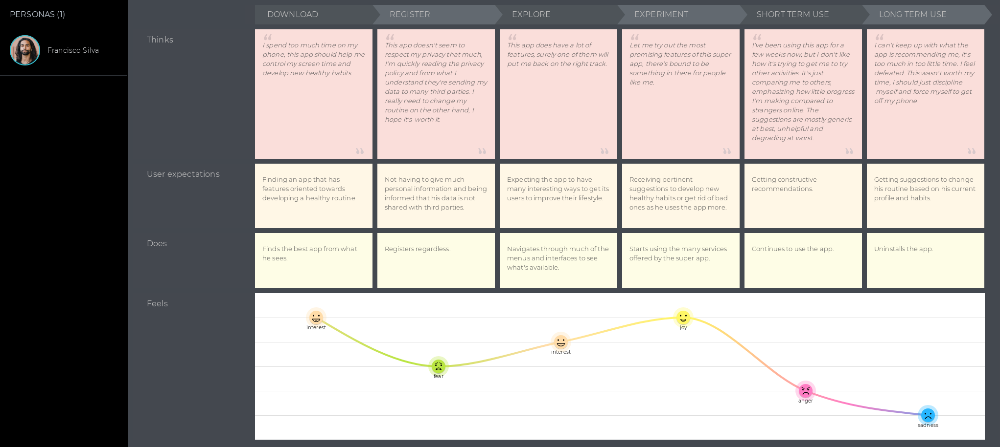

  

    

      <h3>Understanding the problem</h3>
      

        Over the past decade, our phones and smart devices have quickly become an extension of ourselves. We use it to
        capture memories by taking photos, to communicate with our family who may live thousands of miles away, to order
        food when we’re hungry and to hail a ride when we need to get somewhere. Not only do we use our devices for
        convenience's sake, but we now use them to get most of our work done and to entertain ourselves once we've
        stopped working. Unfortunately, this extensive use can take a toll on our body and mind as research has
        demonstrated.
      

      

        For example the university of Gothenburg did a <a
          href="(https://www.recordgazette.net/screen-time-tied-to-health-issues/article_2d5aef9e-ddef-11e8-a22a-ebdc8aced172.html)">
          study</a> where they found a link between heavy screen use and sleep disturbances and/or disorders. There have
        also been studies <a href="(https://www.ncbi.nlm.nih.gov/pmc/articles/PMC5769928/)"> linking screen media
          exposure to increased risks of obesity in children</a>
      

      

        Healthy screen habits have become a hot topic recently with many companies trying to promote them. Apple has
        implemented
        its own screen time services where you can see data related to your screen use and set restrictions to help you
        control
        the amount of time you spend on your devices. There are also seperate apps like Forest which help you control
        the amount
        of time you spend procrastinating on your device.
      

      

        As we won't stop using our devices anytime soon, there probably is or will be a demand for a super app which
        encourages
        and reinforces healthy habits that allows us to accomplish most of our daily tasks.
      

      <h3>Research</h3>
      <h4>Impact of screen time on health</h4>
      
Several papers show that spending a lot of time in front of a computer combined with low physical activity is
        detrimental to one’s health and wellbeing.
        Other papers show that sedentary behaviour itself (which is normally associated with screen time as the majority
        of
        people look at screens while sitting) is bad for your health independent of physical activity.
      

      <h4>Improving poor habits</h4>
      

        The same research demonstrates the importance of clear, consistent and logical rules when it comes to screen
        time
        restrictions. It is simply infuriating for most people to lose functionality or access without knowing precisely
        why and
        what they should do about it when their screen time is restricted directly or indirectly.
        Moreover, educational level, age and self-efficacy must be considered to devise appropriate solutions to reduce
        domestic
        screen time.
      

      <h4>Existing Super Apps</h4>
      
Looking at successful super apps, which were mostly developed and deployed in the East, we've found a few
        traits that
        make superapps attractive to its userbase.

      

        <b>All features that a super app offers are consolidated</b>, the user does not need to download other apps,
        plugins, or
        extensions, the most commonly used features come pre-installed. All those features are made to be convenient and
        presented in an aesthetically similar format to guarantee the uniformity of the experience.
      

      

        <b>Super app dashboards are as simple as possible</b>, so it can achieve adoption as soon as possible. There
        should be
        minimal clutter, let the user navigate though submenus instead and then allow them to create shortcuts once they
        get
        used to using the app. There shouldn’t be clutter for accessibility reasons as well, as a super app should be
        appropriate for all ages.
      

      

        <b>The app being more appealing is prioritized over profitability</b>, successful super apps don't have annoying
        ads, they
        don't obtain a lot of revenue per user, they seek to grow the userbase instead.
      

      

        <b>The app stays out of the way of the user</b>, who should be able to do what they set out to do in minimal
        time. If the
        app recommends anything, it does so discreetly, it seizes control from the user rarely.
      

    

    

      <h3>Survey</h3>
      
To better understand our potential user base, <a
          href="https://docs.google.com/forms/d/e/1FAIpQLScKe6bgUikIwR2UZZE1eU0FnCzc8RLxxlflVDS5PQQwP7CZRQ/viewform?usp=sf_link">surveys</a>
        were sent out to see what kinds of people would be
        willing to use
        a super app that promotes a healthy lifestyle and what they would expect from such an app and what they would
        want to
        use it for.

      
This survey also allowed us to learn more about the existing positive and negative habits of our potential
        users so that
        we can use this data to further guide us through the development and design of the app. Knowing what the
        respondents do
        with their devices and how it already affects their lives made it easier for us to decide what to include in the
        app.

      
As the data shows, most people are willing to use a super with a focus on healthy habits. Most participants are
        already
        use an app to track fitness, but nothing else.
        A good amount of respondents use an app to track their screen time, but the majority thinks they do spend too
        much time
        on their devices, which makes sense given that the majority also spends more than 7 hours per day on their
        devices.

      

        <!-- Indicators -->
        <ol class="carousel-indicators">
          <li data-target="#myCarousel1" data-slide-to="0" class="active"></li>
          <li data-target="#myCarousel1" data-slide-to="1"></li>
          <li data-target="#myCarousel1" data-slide-to="2"></li>
          <li data-target="#myCarousel1" data-slide-to="3"></li>
          <li data-target="#myCarousel1" data-slide-to="4"></li>
        </ol>
        

          

            
          

          

            
          

          

            
          

          

            
          

          

            
            

              
(1 = not interested) - (5 = very interested)

            

          

        

        <a style="color:black;background:transparent;" class="left carousel-control" href="#myCarousel1"
          data-slide="prev">
          
          Previous
        </a>
        <a style="color:black;background:transparent;" class="right carousel-control" href="#myCarousel1"
          data-slide="next">
          
          Next
        </a>
      

      
The interest in the app must partially stem from the negative effects experienced by the participants of the
        survey as
        shown below. Interestingly, most of the pain caused by those bad habits are more mental than physical in nature.
        In all the graphs below, 1 is for non-existent pain/effect while 5/7 is extreme pain/effect.

      

        <!-- Indicators -->
        <ol class="carousel-indicators">
          <li data-target="#myCarousel" data-slide-to="0" class="active"></li>
          <li data-target="#myCarousel" data-slide-to="1"></li>
          <li data-target="#myCarousel" data-slide-to="2"></li>
        </ol>
        

          

            
          

          

            
          

          

            
          

        

        <a style="color:black;background:transparent;" class="left carousel-control" href="#myCarousel"
          data-slide="prev">
          
          Previous
        </a>
        <a style="color:black;background:transparent;" class="right carousel-control" href="#myCarousel"
          data-slide="next">
          
          Next
        </a>
      

      <h3>Personas</h3>
      
Based on the data we gathered through the surveys we set out to create two personas which represent our
        target
        demographic.
        The first persona represents the user whose lifestyle is somewhat healthy but is looking to take it to the
        next
        level. This user would like to make offline
        activities more appealing through the app, mainly by organising activities with people she meets on the app.
      

      
      

        

          

            

              
            

          

        

      

      
The second persona depicts the fear driven user who spends a lot of time in front of a screen who wants to
        fix his lifestyle.
        This user seeks an app that understands his needs and allows him to slowly improve his habits so that he doesn't
        give up.
      

      
      

        

          

            

              
            

          

        

      

      

        <h3> User Journeys</h3>
        
Knowing what the potential users of our app want and expect, we can create user journeys which demonstrate
          how
          their average experience looks
          like with similar apps available on the market. 

        
        
      

      <h3>User Flow</h3>
      

        
      

    

    

      <h2>Final Design</h2>
      <h3>Typography</h3>
      

        

          
Montserrat

          
Montserrat

          
Montserrat

        

        
 We used Montserrat font by Julieta Ulanovsky, it's a clean and elegant font that is easy to understand
        

      

      <h3>Color Palette</h3>
      

        
        
The super app features warmer colors so that using it causes minimal eye fatigue and doesn't disrupt the
          user's sleep cycle as blue light has shown to do.
          Warm color are more related to emotion and passion, which conveys the broad "feel" of the app, which is about
          qualitative improvement more than quantitative improvement.
          The color palette also enhances the dichotomy between the app's two states as shown belo

      

      <h3>Sketches</h3>
      
To start the design of our Super App we created some basic sketches to get a general idea of what we wanted our
        app to
        look like.

      

        
        
        
      

      <h3>Wireframes</h3>
      

        
        

          

            

              

                
              

            

          

        

        
        

          

            

              

                
              

            

          

        

        
        

          

            

              

                
              

            

          

        

        
        

          

            

              

                
              

            

          

        

        
        

          

            

              

                
              

            

          

        

        
        

          

            

              

                
              

            

          

        

        
        

          

            

              

                
              

            

          

        

        
        

          

            

              

                
              

            

          

        

        
        

          

            

              

                
              

            

          

        

        
        

          

            

              

                
              

            

          

        

        
        

          

            

              

                
              

            

          

        

        
        

          

            

              

                
              

            

          

        

        
        

          

            

              

                
              

            

          

        

        
        

          

            

              

                
              

            

          

        

      

      <h3> Features </h3>
      

        
        

          

            

              

                
              

            

          

        

        
For facilitating the exchange of ideas and interests.
          Posts that promote a healthy lifestyle according to those who see it are prioritized.
          Posts that consist of one or more users inviting other people to participate in a social and/or fitness
          activity are similarly promoted.

      

      

        
        

          

            

              

                
              

            

          

        

        
Messaging

      

      

        
        

          

            

              

                
              

            

          

        

        
Group calls

      

      

        
        

          

            

              

                
              

            

          

        

        
Acts as a highly customizable agenda that suggests activities during free time slots based on the user's
          profile. Users can spend coins they've earned
          by using the Deep Focus feature to buy time where they can do what they please and won't be recommended
          anything by the app

      

      

        
        

          

            

              

                
              

            

          

        

        
Limits the user's procrastination so they can work more efficiently and thus spend more time doing diverse
          activities that don't involve
          looking at screens. Staying concentrated for a longer amount of time rewards the user with a bigger amount of
          coins.

      

      

        
        

          

            

              

                
              

            

          

        

        
When the user decides to plan a workout session or routine, the user is asked for what type of workout they
          would like to do.
          The app uses the information it knows about the user and based on their capabilities and preferences it
          constructs the most appropriate workout.

      

      

        
        

          

            

              

                
              

            

          

        

        
Workout Timer

      

      

        
        

          

            

              

                
              

            

          

        

        
        

          

            

              

                
              

            

          

        

        
Spending too much time on the super app will cause the interface to deteriorate.
          When a user exceeds their daily screen time quota the app's vibrant colors will fade away until only a dull
          gray husk is left,
          indirectly incentivizing the user to do something else.

      

      <h3>Final Design</h3>
      
      

        

          

            

              
            

          

        

      

    

  
